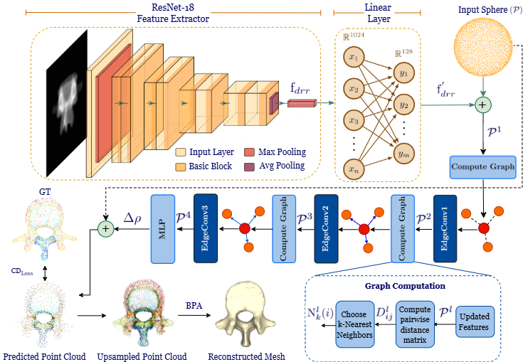
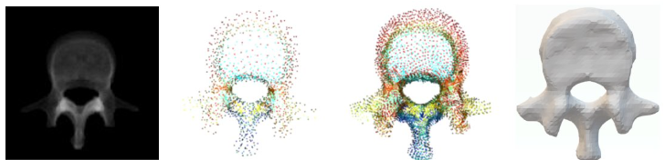
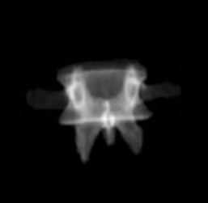
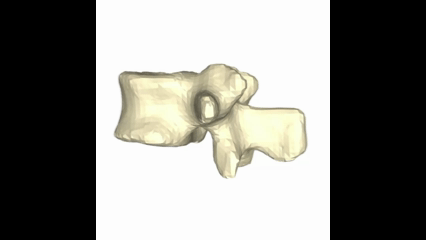
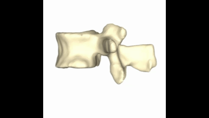

<h1 align="center">3D-ReVert: 3D Reconstruction of Vertebrae from a Single Radiograph for Minimally Invasive Spine Surgery
</h1>

<p  align="center">  
 
Intraoperative imaging in Minimally Invasive Spine Surgery (MISS) commonly uses C-arm fluoroscopy, which provides only 2D views without depth. Although preoperative CT scans offer 3D anatomical detail, their intraoperative use is limited by space and equipment constraints. To address the lack of real-time 3D context, we propose 3DReVert, a novel deep learning framework for reconstructing lumbar vertebra surfaces from 2D DRRs. The dataset required for training 3D-ReVert can be downloaded from: [3DReVert-Dataset](https://drive.google.com/drive/folders/1YBzQlRE8mZOfmKDpoc9omabz6GCIIJbH?usp=sharing) 
<h3 > <i>Index Terms</i> </h3> 

  :diamond_shape_with_a_dot_inside: Minimally Invasive Spine Surgery (MISS)
  :diamond_shape_with_a_dot_inside: Single view Surface Reconstruction(SVR)
  :diamond_shape_with_a_dot_inside: Digitally Reconstructed Radiograph (DRR) 
  :diamond_shape_with_a_dot_inside: Dynamic Graph CNNs
  :diamond_shape_with_a_dot_inside: Point Cloud 
  :diamond_shape_with_a_dot_inside: Mesh

</div>
<p align="center">
  
</p>
<div align = "center">
  :small_orange_diamond: 3D-ReVert architecture consisting a ResNet-18 encoder and a DGCNN decoder
 </p>

### Workflow of 3D-ReVert

<details>
<summary><b>Show Details</b></summary>



*Sample input → output pair from the dataset.*

</details>
</div>
</details>
<h2 align="center">Dataset</h2>
<details>
 
<summary><b>Details</b></summary>

You can download the dataset from the following link:  
🔗 <a href="https://drive.google.com/drive/folders/1YBzQlRE8mZOfmKDpoc9omabz6GCIIJbH?usp=sharing" target="_blank">3DReVert-Dataset</a>  

We present an open-source dataset for SVR of lumbar vertebrae comprising 475 unique mesh–DRR pairs.  
For each mesh, DRRs are rendered from 24 diverse viewpoints, resulting in an augmented dataset of 11,400 mesh–DRR pairs.


**Sub-directory-based arrangement:**

```
DRR/
├── verse004_segment_20/
│  ├── rendering/
│    ├── 00.png
│    ├── 01.png
│    ├── 02.png
│    └── ...
├──verse005_segment_20/
│   ├── rendering/
│   │   ├── 00.png
│   │   ├── 01.png
│   │   ├── ...
│   │   └── 23.png
├── ...  
│   └── ...
Mesh/
├── verse004_segment_20.stl/..
├── verse005_segment_20.stl/..
├── ...
```
</details>

## <div align="center">Pre-requisites</div>


To run the **3DReVert** project, ensure your environment meets the following requirements:

<details>
<summary><strong>✅ System Requirements</strong></summary>
 
- GPU: **NVIDIA RTX 4090** or equivalent
- CUDA: **Version 11.8**
- Python: **Recommended 3.10+**
- PyTorch: **2.5.1**
- Visual Studio: **2019**
  
</details>

<details>
<summary><strong>✅ PyTorch Installation</strong></summary>

PyTorch is required and must be installed from source to match CUDA 11.8 and Torch 2.5.1:

```bash
conda install pytorch==2.5.1 torchvision==0.20.1 torchaudio==2.5.1  pytorch-cuda=11.8 -c pytorch -c nvidia
```

> **Note:** Ensure `torch`, `torchvision`, and `torchaudio` are installed *before* installing PyTorch.

---
</details>

## <div align="center">Installation</div>
:arrow_right: Clone the Repository  
```bash
git clone https://github.com/YourUsername/3D-ReVert.git
```
:arrow_right: Navigate to the Project Directory 
```bash
cd 3D-ReVert
```
:arrow_right: Create and Activate a Virtual Environment  
```bash
python -m venv revert_env
.\revert_env\Scripts\Activate
```
:arrow_right: Install the python dependencies
```bash
pip install -r requirements.txt
```
:arrow_right: Chamfer Distance Compilation
```bash
cd utils/ChamferDistancePytorch/chamfer3D
python setups.py install
```

## <div align="center">Usage</div>
After downloading the dataset,

:arrow_right: Change the path in 3DReVert.yaml
```bash
pointcloud_path: 'Path/PointCloud'
image_path: 'Path/Renderings'
cache_path: 'Path/cache'
cache_path: 'Path/cache_test
```
:arrow_right: To train the model:
```bash
python 3DReVert_train.py -c configs/3DReVert.yaml -gpu 0
```
:arrow_right: To test the model:
```bash
python 3DReVert_val.py -c configs/3DReVert.yaml -gpu 0
```

## <div align="center">Demo</div>

To run the demo for a single 2D DRR 

```bash
python sit_demo.py -c configs/3DReVert.yaml -gpu 0
```


<h2 align="center">Results</h2>

<table align="center">
  <tr>
    <th style="padding: 10px;">Input (DRR)</th>
    <th style="padding: 10px;">Predicted</th>
    <th style="padding: 10px;">Ground Truth</th>
  </tr>
  <tr>
    <td align="center" style="padding: 10px;">
      
    </td>
    <td align="center" style="padding: 10px;">
      
    </td>
    <td align="center" style="padding: 10px;">
      
    </td>
  </tr>
</table>
