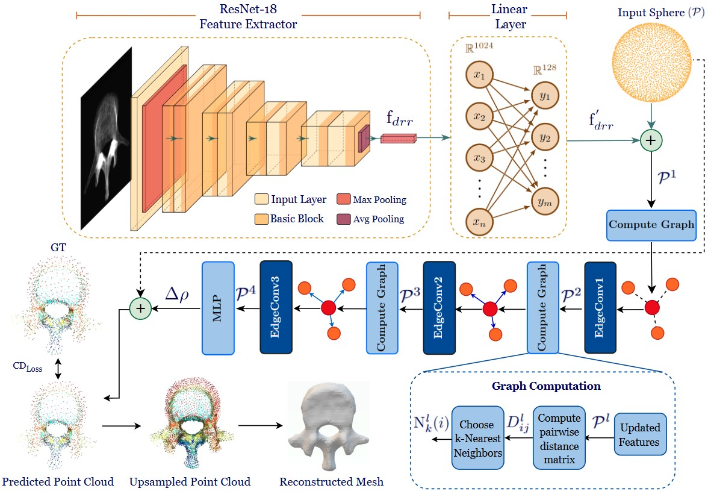

<h1 align="center">3D-ReVert: 3D Reconstruction of Vertebrae from a Single Radiograph for Minimally Invasive Spine Surgery
</h1>

<p  align="center">  
 
`Abstract`:Intraoperative imaging during Minimally Invasive Spine Surgery (MISS) typically relies on C-arm fluoroscopy, which generates 2D X-ray images of the vertebrae but lacks depth information. While preoperative CT scans offer detailed 3D anatomical insights, their use during surgery is often impractical due to limitations in space and equipment mobility, making the availability of real-time 3D anatomical context during the procedure incomplete and challenging.

`Problem Statement`: Reconstruction of 3D surface model of the lumbar vertebrae from a single 2D Radiograph for real-time 3D anatomical context for more informative tracking and guidance.

`Method`: We propose 3DReVert, a novel deep learning framework to obtain the surface reconstruction of the lumbar vertebrae from the 2D DRRs. Our generated dataset [3DReVert-Dataset](https://drive.google.com/drive/folders/1YBzQlRE8mZOfmKDpoc9omabz6GCIIJbH?usp=sharing) consisting of DRR-Mesh pairs is used to train our model.

`Results`: . The surface reconstructed using the 3DReVert framework achieves a Dice Score of 80% and an HD95 of 2.06 mm, demonstrating a clinical accuracy well within the 2 mm threshold.

 </p>
<h3 > <i>Index Terms</i> </h3> 

  :diamond_shape_with_a_dot_inside: Minimally Invasive Spine Surgery (MISS)
  :diamond_shape_with_a_dot_inside: Single view Surface Reconstruction(SVR)
  :diamond_shape_with_a_dot_inside: Digitally Reconstructed Radiograph (DRR) 
  :diamond_shape_with_a_dot_inside: Dynamic Graph CNNs
  :diamond_shape_with_a_dot_inside: Point Cloud 
  :diamond_shape_with_a_dot_inside: Mesh

</div>

<h2 align="center">Dataset</h2>
<details>

You can download the dataset from the following link:

🔗 [3DReVert-Dataset](https://drive.google.com/drive/folders/1YBzQlRE8mZOfmKDpoc9omabz6GCIIJbH?usp=sharing) 

We present an open-source dataset for SVR of lumbar vertebrae comprising of 475 unique mesh–DRR pairs. For each mesh, DRRs are rendered from 24 diverse view-points, resulting in an
augmented dataset of 11,400 mesh–DRR pair  
   - The 3DReVert-dataset is split into train, validation and test data in the70:20:10 split

Sub-directory-based arrangement:

```
DRR/
├── verse004_segment_20/
│  ├── rendering/
│    ├── 00.png
│    ├── 01.png
│    ├── 02.png
│    └── ...
├──verse005_segment_20/
│   ├── rendering/
│   │   ├── 00.png
│   │   ├── 01.png
│   │   ├── ...
│   │   └── 23.png
├── ...  
│   └── ...
Mesh/
├── verse004_segment_20.stl/..
├── verse005_segment_20.stl/..
├── ...
```
</details>

## <div align="center">Methodology</div>
<p align="center">
  
</p>
<div align = "center">
  
